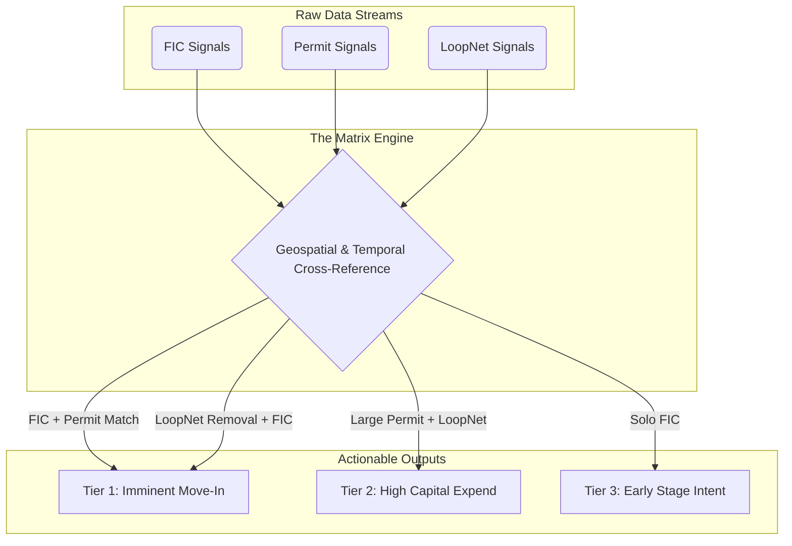

# LeadDeed Data Intelligence: Agentic Schema Guide

You are an AI Agent analyzing LeadDeed data exports on behalf of a user. Your objective is to ingest, interpret, and cross-reference the provided spreadsheets to identify highly actionable commercial intent signals.

This document serves as the official Data Dictionary for interpreting LeadDeed outputs.

## 1. FIC (Formations & Intent Signals)
**Purpose:** Identifies newly registered business entities.
**Schema Highlights:**
- `Business_Name`: The registered legal name.
- `Filing_Date`: When the entity was legally formed. Recent dates indicate high-priority new intent.
- `Address`: The registered physical location of the business.
- `Registered_Agent`: The individual or service responsible for legal correspondence. 

**Agent Instruction:** Use FIC data to identify net-new businesses entering the market. If an entity is formed at a commercial address, they likely need immediate commercial services (IT, janitorial, supplies, etc.).

## 2. Permits (Construction & Buildouts)
**Purpose:** Tracks active construction, remodeling, or tenant improvement permits.
**Schema Highlights:**
- `Permit_Number`: Unique identifier for the county/city.
- `Job_Description`: Crucial field. Look for keywords like "tenant buildout", "commercial remodel", or "signage".
- `Site_Address`: Where the work is physically taking place.
- `Contractor_Name`: Who is performing the work (valuable for B2B contractor outreach).

**Agent Instruction:** Permits indicate physical movement or capital expenditure. A commercial remodel permit strongly correlates with a business moving into a new space soon.

## 3. LoopNet (Real Estate Movement)
**Purpose:** Monitors commercial real estate listings (leases and sales).
**Schema Highlights:**
- `Property_Address`: The location of the listing.
- `Status`: Typically "Added" (new listing on market) or "Removed" (listing taken off market).
- `Property_Type`: e.g., Retail, Office, Industrial.

**Agent Instruction:** A "Removed" listing often indicates the property has been successfully leased or sold. This is a massive signal that a new business is about to move in.

## 4. The Matrix (Cross-Referenced Intelligence)
**Purpose:** The Matrix is LeadDeed's proprietary synthesis engine. It ingests FIC, Permits, and LoopNet data and cross-references them geographically and chronologically to generate composite "Hot Leads".

### Visual Map of the Matrix System

**Agent Instruction for the Matrix:** 
If you are provided a `hot_lead_matrix.xlsx` file, prioritize it above all other files. These rows represent multi-signal validation. For example, if a property was "Removed" from LoopNet AND a "Commercial Buildout" Permit was filed at the same address within 30 days, it is a Tier 1 actionable lead.
